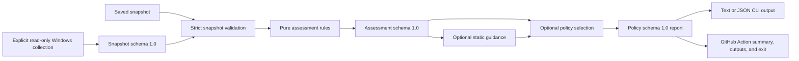

# RigPilot

[](https://github.com/Arturo6PR/rigpilot/actions/workflows/ci.yml)
[](https://github.com/Arturo6PR/rigpilot/releases/latest)


RigPilot turns Windows workstation inventory into strict, deterministic assessment reports and
CI policy decisions. Collection is explicit and read-only; saved snapshots can be assessed on
Windows or Linux without probing the machine that runs the assessment.

> RigPilot never remediates findings, changes drivers or firmware, edits system settings, or
> sends telemetry to a RigPilot service.

## What RigPilot proves

| Capability | Result |
| --- | --- |
| Inventory | Timeout-bounded Windows probes with explicit `success`, `unavailable`, or `failed` state. |
| Assessment | Deterministic findings for probe coverage, storage capacity, hardware change, and BIOS age. |
| Policy | Reusable schema-1.0 selectors and an optional fail threshold for automation. |
| Automation | Versioned JSON, stable exit codes, and a thin GitHub Action using the same CLI engine. |
| Safety | No shell-based probes, telemetry, cloud account, automatic advice execution, or remediation. |

## Five-minute quickstart

Python 3.11-3.13 is supported. From a clone, install RigPilot in an isolated environment and run
the deterministic demo:

```powershell
py -3.12 -m venv .venv
.\.venv\Scripts\python.exe -m pip install .
powershell -NoProfile -ExecutionPolicy Bypass -File .\examples\github-actions\Run-Demo.ps1 -Python .\.venv\Scripts\python.exe
```

The demo uses only synthetic repository fixtures, writes reports under the system temporary
directory, removes them, and never collects workstation data. Its stable proof transcript is:

```text
RigPilot deterministic CI demo: PASS
Version: rigpilot 1.0.0
Passing policy: exit 0, policy schema 1.0
Failing policy: exit 3, 12 triggering findings, report emitted
Repeated JSON report: byte-for-byte identical
Live collection: not performed
```

The same passing policy command is:

```powershell
.\.venv\Scripts\rigpilot.exe assess examples\github-actions\current.json --policy-file examples\github-actions\rigpilot-policy.json --format json --output rigpilot-assessment.json
```

RigPilot creates a strict policy-schema-1.0 JSON report and leaves stdout empty. It refuses to
overwrite an existing output. Delete the generated file before repeating that command.

## How it fits together



Assessment, guidance, and policy are pure transformations. Only the explicit inventory command
or `assess --live` crosses the collection boundary. The GitHub Action accepts saved files only
and never performs live collection. See [Architecture](docs/ARCHITECTURE.md) for the component and
trust boundaries.

## Use a real saved snapshot

On Windows 11, explicitly collect a local snapshot without a hostname:

```powershell
.\.venv\Scripts\rigpilot.exe --json --no-hostname > current.json
.\.venv\Scripts\rigpilot.exe assess current.json
.\.venv\Scripts\rigpilot.exe assess current.json --format json
```

Review snapshots before sharing them: hardware identities, volume labels, and executable paths
may be sensitive. `--redact` removes the documented sensitive fields from rendered inventory;
`--no-hostname` records a schema-compatible `null` hostname.

Create a reusable policy file:

```json
{
  "policy_config_schema_version": "1.0",
  "minimum_severity": "warning",
  "rule_groups": ["probes", "storage", "hardware", "bios"],
  "checks": null,
  "fail_on": "warning"
}
```

Then generate a machine-readable report:

```powershell
.\.venv\Scripts\rigpilot.exe assess current.json --policy-file rigpilot-policy.json --format json --output assessment.json
```

Exit `0` means the operation completed without a triggered policy. Exit `3` means RigPilot wrote
the report and the configured threshold triggered. Findings without a fail threshold still exit
`0`. The complete option, assessment-rule, encoding, and output reference is in the
[CLI guide](docs/CLI.md).

## GitHub Actions policy gate

Store a saved snapshot and policy in the repository, then use the v1-compatible Action alias:

```yaml
name: RigPilot

on:
  pull_request:
  push:

permissions:
  contents: read

jobs:
  rigpilot:
    runs-on: ubuntu-latest
    steps:
      - uses: actions/checkout@9c091bb21b7c1c1d1991bb908d89e4e9dddfe3e0 # v7.0.0
      - name: Apply RigPilot policy
        id: rigpilot
        uses: Arturo6PR/rigpilot@v1
        with:
          snapshot: examples/github-actions/current.json
          policy: examples/github-actions/rigpilot-policy.json
          report: rigpilot-assessment.json
```

The Action:

- installs RigPilot from the referenced Action revision;
- runs the existing CLI against saved inputs;
- preserves the deterministic JSON report at `report`;
- writes a compact GitHub Step Summary;
- exposes `status`, `passed`, `warnings`, `failed`, `critical`, `report`, `exit_code`, and
  `summary`; and
- fails only after safely emitting a policy-triggered report and summary.

It needs no secret and no permission broader than the caller's `contents: read` checkout. Paths
must be workspace-relative, the report parent must exist, and the report path must be new. Use
`@v1.0.0` for the exact first stable release or a verified commit SHA for immutable pinning.

The [copyable example](examples/github-actions) includes the workflow, clean and failing synthetic
snapshots, policy, expected report, and executable local proof.

## Stable public contracts

RigPilot v1 treats the documented CLI, exit codes, schema-1.0 formats, and GitHub Action interface
as compatibility contracts. Existing v0.7 policy files, v0.8 structured reports, and v0.9 Action
workflows require no migration.

| Exit code | Meaning |
| ---: | --- |
| `0` | The operation completed; findings alone do not fail an assessment. |
| `1` | An unexpected operational or internal error prevented completion. |
| `2` | Arguments, inputs, paths, encodings, JSON, or policy configuration were invalid. |
| `3` | A policy report was emitted and its configured `fail_on` threshold triggered. |

All five JSON contracts use strict Draft 2020-12 schemas and an explicit `1.0` version field:
snapshot, assessment, guidance, policy report, and policy configuration. See the authoritative
[v1 compatibility contract](docs/COMPATIBILITY.md).

## Repository map

```text
action.yml                    Composite GitHub Action contract
src/rigpilot/                 Collectors, pure engines, CLI, and Action adapter
docs/*.schema.json            Packaged strict JSON contracts
docs/ARCHITECTURE.md          Components, data flow, and trust boundaries
docs/CLI.md                   Complete user-facing command reference
docs/COMPATIBILITY.md         Stable v1 public contract
docs/VERIFICATION.md          Reproducible proof and CI evidence
examples/github-actions/      End-to-end saved-snapshot policy gate
scripts/Test-RigPilot.ps1     Complete repository verification entry point
tests/                        Behavioral, schema, privacy, and compatibility tests
```

## Development and verification

Install the development dependencies and run the complete verification entry point:

```powershell
uv sync --extra dev
powershell -NoProfile -ExecutionPolicy Bypass -File .\scripts\Test-RigPilot.ps1
```

CI exercises Python 3.11-3.13 with Windows PowerShell 5.1 and PowerShell 7, plus the composite
Action on Ubuntu using deterministic fixtures. The demo above also runs in CI. For commands,
expected evidence, and clean-install checks, see [Verification](docs/VERIFICATION.md).

## Scope and limitations

- Windows 11 and PowerShell are the primary inventory environment; saved-file assessment and the
  Action are also tested on Ubuntu.
- Disk `Status` is the Windows CIM value, not a complete SMART health diagnosis.
- Guidance is static and cautious; it never downloads software, chooses firmware, or executes a
  recommendation.
- RigPilot reports point-in-time evidence. It does not optimize settings or modify drivers,
  firmware, the registry, services, startup items, or power plans.

## Project references

- [CLI and assessment reference](docs/CLI.md)
- [Architecture and safety model](docs/ARCHITECTURE.md)
- [Stable v1 compatibility contract](docs/COMPATIBILITY.md)
- [Reproducible verification evidence](docs/VERIFICATION.md)
- [Project brief](docs/PROJECT_BRIEF.md)
- [Changelog](CHANGELOG.md) and [v1.0.0 release notes](docs/RELEASE_NOTES_v1.0.0.md)
- [Security reporting guidance](SECURITY.md)
