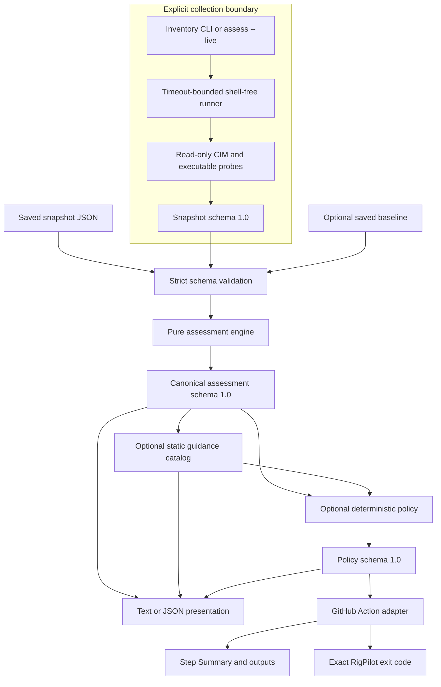

# RigPilot architecture

RigPilot separates explicit workstation collection from deterministic analysis. A saved snapshot
is ordinary JSON: the same validated input produces the same assessment, guidance, policy view,
text rendering, and JSON report on Windows or Linux.

## Data flow

The saved-snapshot path begins at strict validation and cannot execute a collector. Live
assessment collects exactly once in memory, removes the hostname, validates the snapshot, and
then enters the same pure pipeline.

## Components

| Area | Files | Responsibility |
| --- | --- | --- |
| Process boundary | `runner.py` | Runs fixed argument arrays without a shell and enforces timeouts. |
| Inventory | `collectors.py`, `models.py` | Converts read-only probe output into typed snapshot checks. |
| Snapshot I/O | `diffing.py` | Decodes supported encodings and performs strict packaged-schema validation. |
| Assessment | `assessment.py` | Applies deterministic coverage, capacity, hardware, and BIOS rules. |
| Guidance | `guidance.py` | Adds versioned, static, non-executable wording without changing findings. |
| Policy | `policy_config.py`, `policy.py` | Validates reusable selectors and derives views, counts, and decisions by canonical index. |
| CLI | `cli.py` | Parses commands, coordinates the pipeline, renders output, and preserves exit contracts. |
| GitHub Action | `github_action.py`, `action.yml` | Calls the CLI-compatible pipeline and derives summary/outputs from the validated policy report. |
| Contracts | `docs/*.schema.json` | Strict Draft 2020-12 snapshot, assessment, guidance, policy, and policy-config schemas. |

## Determinism boundary

Saved-file behavior is deterministic for identical bytes and arguments:

- supported encodings decode to one validated object;
- assessment findings retain canonical rule order;
- hardware identities compare as normalized multisets while sensitive values stay out of
  findings;
- summary counts and highest severity derive from the findings array;
- guidance comes from a versioned static catalog;
- policy views reference canonical finding indices rather than copying or reordering findings;
- JSON uses stable key order, indentation, and one final newline.

Live collection necessarily supplies a current timestamp and current workstation evidence. BIOS
age is calculated from the snapshot's collection timestamp, not the time an assessment command
happens to run. Probe durations are recorded in snapshots but do not affect assessment rules.

## Trust and privacy boundaries

Collection uses read-only CIM queries and fixed executable invocations. It never invokes a
command shell. Timeouts, missing executables, nonzero exits, malformed data, and operating-system
errors become explicit probe states instead of causing partial silent success.

Snapshots may contain hostnames, volume labels, executable paths, and hardware identities, so
they remain local unless a user explicitly redirects or commits them. Assessment and later
layers intentionally omit those values, raw probe errors, and full before/after identities.

The GitHub Action:

- accepts saved workspace files only;
- validates that snapshot, policy, and report paths stay inside `GITHUB_WORKSPACE`;
- passes inputs through environment variables and Python argument arrays;
- needs no secret and no RigPilot service;
- derives all outputs and summary content from the validated structured report; and
- propagates exit `3` only after the report and summary are produced.

## Failure model

Expected input and configuration problems return `2` with concise stderr. Unexpected internal or
operational failures return `1` without exposing sensitive exception text. A completed assessment
returns `0` even when findings exist. A configured policy threshold returns `3` after successful
serialization or output-file creation.

Machine-readable stdout is JSON only. With `--output`, successful stdout is empty. This keeps
diagnostics from corrupting downstream automation.

## Packaging and verification

All five schemas are packaged with the wheel and loaded without relying on a source checkout.
Wheel metadata declares the SPDX license expression `Apache-2.0` and carries the complete
top-level [`LICENSE`](../LICENSE) text. Tests lock the schemas, fixtures, CLI surface, exit codes,
v0.7 policy compatibility, v0.8 report compatibility, v0.9 Action compatibility, privacy
constraints, output determinism, and packaged license metadata. CI runs the Windows
Python/PowerShell matrix and an Ubuntu Action job against synthetic fixtures.

The repository-owned [deterministic demo](../examples/github-actions) exercises the complete
saved snapshot -> policy -> JSON report -> exit decision path twice without live collection.

## Non-goals

RigPilot does not remediate findings, run guidance, choose drivers or firmware, upload reports,
provide a cloud control plane, or treat point-in-time inventory as a full hardware-health
diagnosis.
